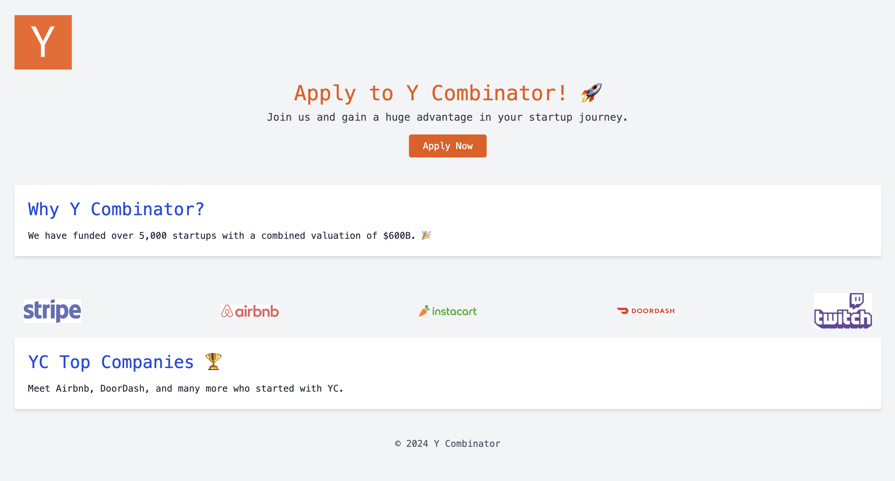

# Variant Generator



Given any url, generate a _retro_ variant of it. (Was for a coding challenge)

## Quick Start

1. Start the server

   ```
   yarn dev
   ```

2. In another pane/shell/terminal, run the script

   ```
   yarn cli
   ```

   and put in any url you want.

3. Hot reload does all the work, just visit `https://localhost:3000` and you're all set!

Tip: use your personal website 🎨
